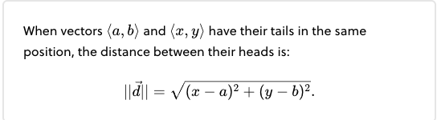
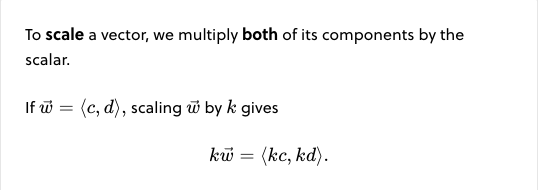
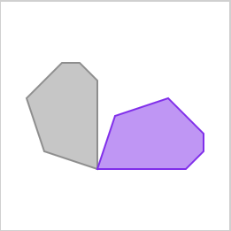
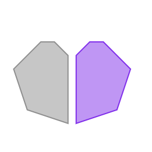
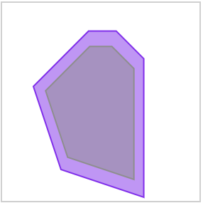
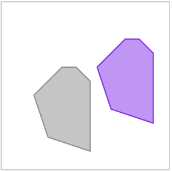
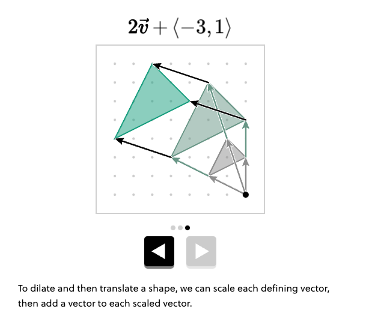

# Vectors

## Meet vectors

A **vector** is a shift in space. We can represent it with an arrow.

<figure><figcaption></figcaption></figure>

A vector has a horizontal part and a vertical part, called **components**. The components of a vector are the horizontal and vertical distances that it travels. In $$\mathbf{v} = \begin{pmatrix} a \\ b \end{pmatrix}$$ a nd b are the components

How do we get to the point in the exact middle?

<figure><figcaption></figcaption></figure>

Vectors that have the same components are the **same vector**

### Vectors and points

The way we write the vector ⟨3,4⟩ and the point (3,4) look really similar.

Are the vector and point really the same thing?&#x20;

No. One is a **move**, while the other is a **location**

When a vector \<a,b> shifts an object starting from the origin, the object ends up at the point (a,b)

_**We can think of a vector as a shift in space.**_

## Adding vectors

Let's see how to express a sequence of moves, and then how to reverse a move

A sequence of shifts is equivalent to a shift by **one** vector.

That vector goes from the tail of the first vector to the head of the last vector.

A **component** is a part of a vector. The components tell how much a shift the vector produces in the horizontal and vertical directions.

For example, the vector ⟨3,4⟩ has a horizontal component of 3, and a vertical component of 4.

To find the effect of shifting by multiple vectors in order, we can **add the vectors.**

That means adding up the vectors' components

\<a,b> + \<c,d> = \<a + c, b + d>

* By adding vectors, we can find one vector that's equivalent to a sequence of shifts.
* By changing the sign of a vector's components, we can reverse the vector's direction.

## From One to Another

## Length of a vector

To know how far something moves, or the distance between two things, we can use the length of a vector.

We can use geometry to calculate vector lengths.

<figure><figcaption></figcaption></figure>

<figure><figcaption></figcaption></figure>

By treating a vector and its components as a right triangle, we can apply the **Pythagorean theorem** to find the vector's length.

$$\|\mathbf{v}\| = \sqrt{(a^2 + b^2}$$)

That lets us find the distance between a pair of objects.

## Scaling vectors

Sometimes we need to change a vector's length while maintaining its direction.

<figure><figcaption></figcaption></figure>

k > 0: Scaling a vector maintains its direction while changing its length.

## Between two Vectors

Between the heads of two vectors, there are infinitely many points.

How do we get to the point in the exact middle?

## Moving Along a Line

We can write a vector to move to the point exactly halfway between the heads of two vectors, but how do we locate any point on a line defined by two vectors?

**Defining a line**

In _Space Game_, the asteroid moves along a linear path.

Let's write an expression with vectors to describe a line.

## Transformations with Vectors

Editing a digital image might involve resizing, flipping, or rotating the shapes within it.

Let's see how computers make those edits, and what vectors have to do with it.

That's right. **To** **turn** means to spin around a point.

<figure><figcaption></figcaption></figure>

**A flipped** image is a mirror image of the original

<figure><figcaption></figcaption></figure>

A **resized** image is a scaled copy of the original shape.&#x20;

<figure><figcaption></figcaption></figure>

A **slide** is a movement across the screen without any turning

<figure><figcaption></figcaption></figure>

Turns, flips, resizes, and slides are all examples of transformations.

A **transformation** is a rule that is applied to every vector that defines an image.

## Translations

A **translation** changes an image's position by sliding it.

For every vector \<x, y> that defines an image, the rule

\<x + a, y + b>

results in a _translation_ of the image by the vector \<a, b>

To translate an image to a different position, we add the same vector to all of its defining vectors.

## Dilations&#x20;

Copies of different sizes can make a design with an appealing pattern.

Let's find a rule that will resize an image.

A **dilation** is a scaled copy of a shape. It's created by scaling each of a shape's vectors by the same factor.

To **dilate** a shape, we scale its vectors — that means multiplying each vector component by a scalar.

**Combining transformations**

<figure><figcaption></figcaption></figure>

## kv + w&#x20;

## Reflections&#x20;

