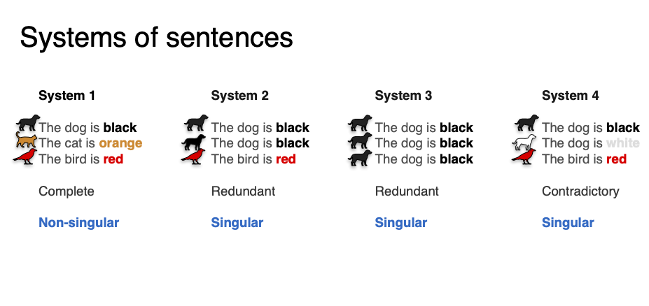
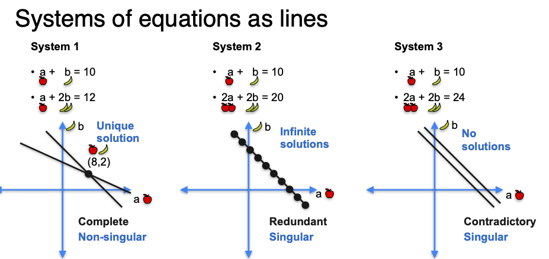
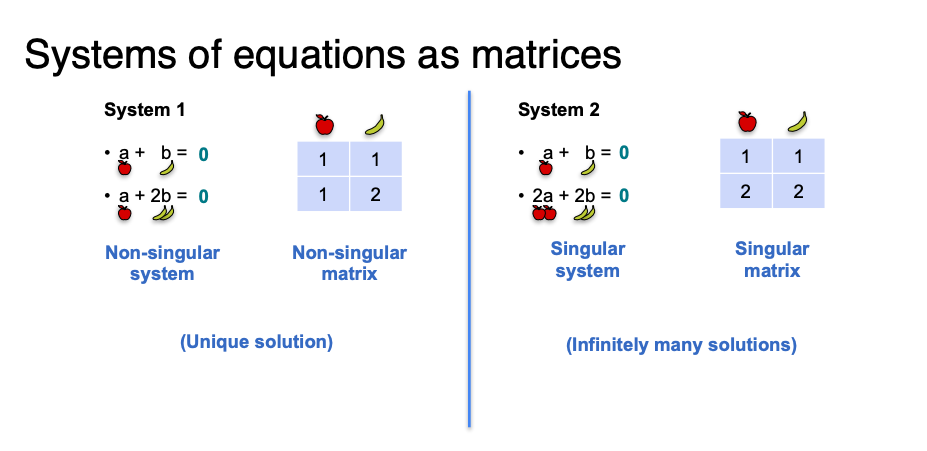

# Week 1: System of linear equations

### System of equations

A **System of equations** is two or more equations with the same variables that express different relationships.

<figure><figcaption></figcaption></figure>

A **solution to a system of equations** is the one pair or values that makes both equations **true**

<figure><figcaption></figcaption></figure>

<figure><figcaption></figcaption></figure>

The system of equations can be simplified for the proposal of determining if is singular or not singular

The system of equations as lines in the figure above, can be simplified since knowing if the system is redundant or contradictory is not usually a question we want to answer:

Systems of two linear equations can have zero, one, or infinitely many solutions, which we see from how their graphs interact.

<figure><figcaption></figcaption></figure>

#### Singular vs no-singular matrices

<figure><figcaption></figcaption></figure>

#### Linear dependent (singular) and linear independence ( no singular)

<figure><figcaption></figcaption></figure>

