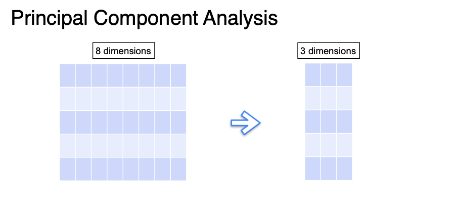
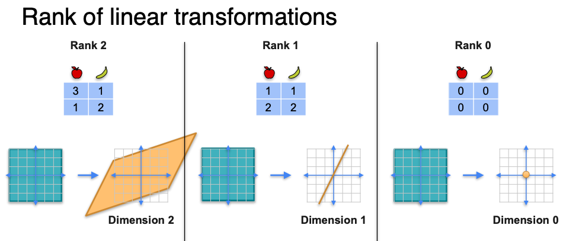
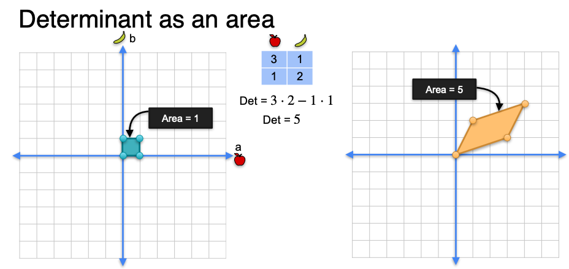

# Week 4: Determinants and eigenvectors

What is PCA:

<figure><figcaption></figcaption></figure>

<figure><figcaption></figcaption></figure>

The rank of a linear transformation:

<figure><figcaption></figcaption></figure>

Determinant as an area

<figure><figcaption></figcaption></figure>
