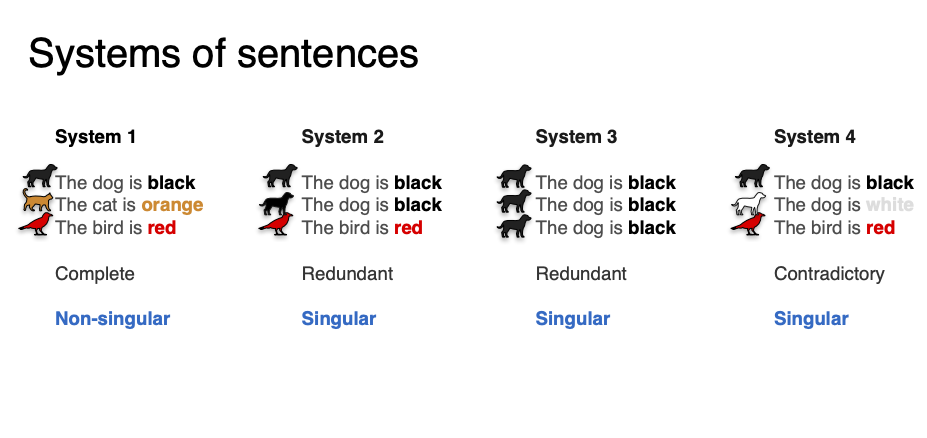
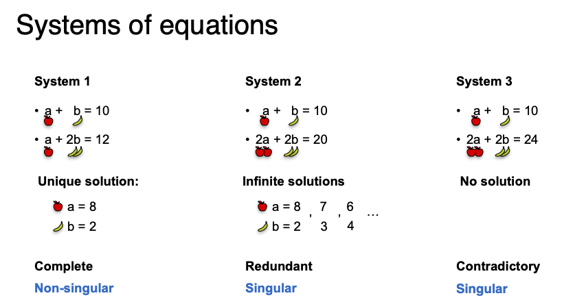
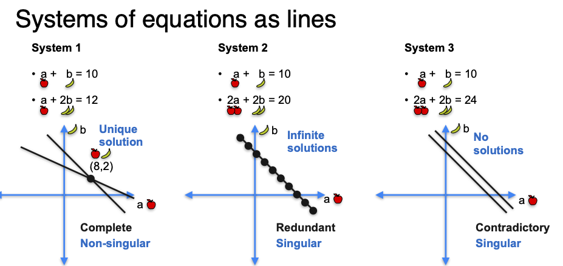
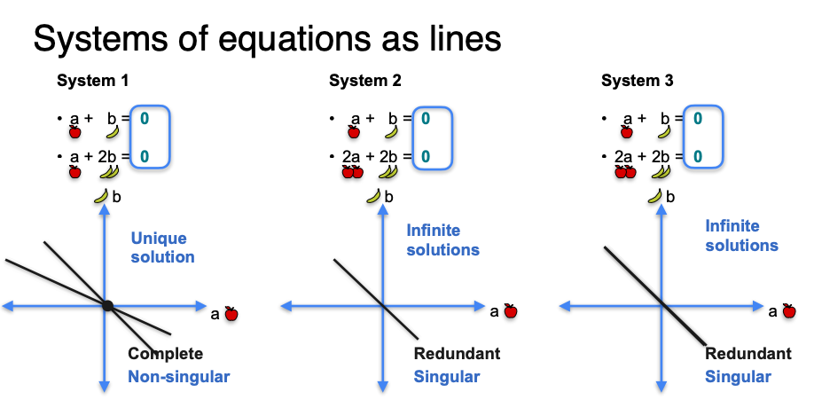
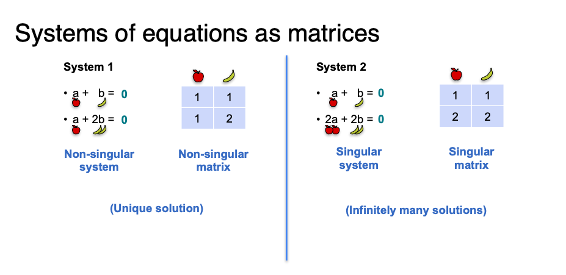
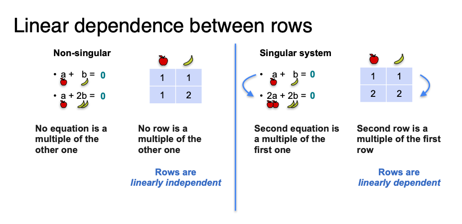

# Systems of Equations

### System of equations

<figure><figcaption></figcaption></figure>

<figure><figcaption></figcaption></figure>

<figure><figcaption></figcaption></figure>

The system of equations can be simplified for the proposal of determining if is singular or not singular&#x20;

The system of equations as lines in the figure above,  can be simplified since knowing if the system is redundant or contradictory is not usually a question we want to answer:

<figure><figcaption></figcaption></figure>

#### Singular vs no-singular matrices

<figure><figcaption></figcaption></figure>

#### Linear dependent (singular)  and linear independence ( no singular)

<figure><figcaption></figcaption></figure>

### Substitution

### Elimination

### Linear systems

