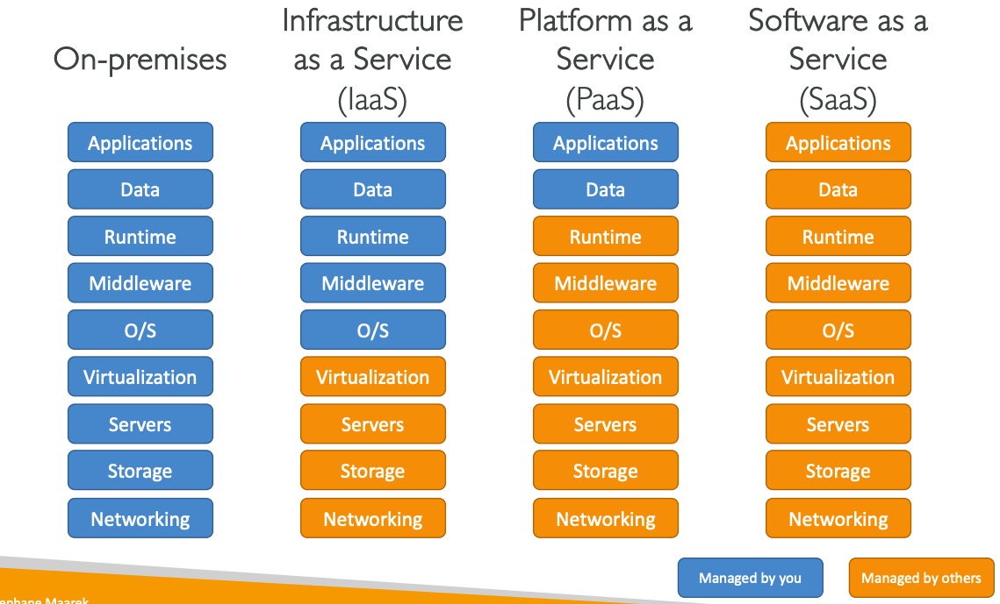

# Cloud Fundamentals

### What is cloud computing?&#x20;

How does the traditional IT infrastructure (ON-PREMISE) scale?

<figure><figcaption>
traditional IT infrastructure 
</figcaption></figure>

Traditional IT infrastructure typically involves in-house management of **physical servers**, **networking equipment, and storage solutions**. While this setup has worked for many years and continues to be effective for some companies, it comes with its **own set of challenges and limitations**.

The problems you can solve if you decide to build your software company on top of the cloud computing provider:

* Pay for the rent for the data center
* Pay for the power supply, cooling, maintenance
* Adding and replacing hardware takes time
* Scaling is limited
* Hire a 24/7 team to monitor the infrastructure
* How to deal with disasters? (earthquake, power shutdown, fire)
* Security team specialist
* Dealing with global distribution

There are different levels of IT solutions as a service, usually, the companies use a mix of those levels.

<figure><figcaption>
You manager vs Other manage
</figcaption></figure>

1. **ON-PREMISES IT**: Everything is managed in-house, from data to the data center.
2. **COLOCATION**: Similar to on-premises, but the data center is typically rented space in a third-party facility.
3. **HOSTING**: The hosting provider typically manages the physical infrastructure while you manage everything else.
4. **IaaS (Infrastructure as a Service)**: You manage applications, data, runtime, and middleware. The rest is provided by the service vendor.
5. **PaaS (Platform as a Service)**: You manage applications and data; the platform provider takes care of the rest.
6. **SaaS (Software as a Service)**: Only the data is managed by you. The software application and everything beneath it is provided and managed by the service vendor.

### What does cloud computing provide as a service?&#x20;

* Cloud computing offers on-demand access to computing power, database storage, and various applications.
* It operates on a pay-as-you-go pricing model, allowing you to pay only for the resources you actually use.
* Resources can be quickly scaled up or down to meet changing demands, providing flexibility and agility.
* Access is available over the internet from a variety of devices, making it highly accessible.
* Maintenance, security, and updates are generally managed by the service provider, reducing the burden on your in-house team.

### The five characteristics of cloud computing

1. On-Demand Self-Service: Users can allocate and manage resources themselves without needing to interact with a human service provider.
2. Broad Network Access: Cloud services are accessible over the internet from a variety of devices, such as laptops, smartphones, and tablets.
3. Resource Pooling: Multiple users share a pool of computing resources, but these can be dynamically allocated and reassigned based on demand.
4. Rapid Elasticity: Resources can be quickly scaled up or down to accommodate varying workloads and demands.
5. Measured Service: Cloud systems automatically control and optimize resources, often using a metered, pay-as-you-go model.

### Six advantages of cloud computing:

1.  Trade capital expenses (CAPEX) for operational expenses (OPEX)

    Reduce total cost of Ownership (TCO) and Operation Expense
2.  Benefit from massive economies of scale

    Prices are reduced as AWS is more efficient due to large-scale
3.  Stop guessing capacity

    Scale based on actual measured usage
4. Increase speed and agility
5. Stop spending money running and maintaining data centers
6. Go global in minutes: leverage the AWS Global Infrastructure

### Problems solved by the cloud

* **Flexibility**: change resource types when needed
* **Cost-effectiveness**: pay as you go, for what you use
* **Scalability**: accommodate larger loads by making hardware stronger or adding additional nodes
* **Elasticity**: ability to scale out and scale in when needed
* **High-availability and fault-tolerances**: build across data centers
* **Agility**: rapidly develop, test and launch software applications

### The deployment models of the cloud:

*   **Private Cloud**:

    * Cloud services used by a single organization, are not exposed to the public
    * Complete control
    * Security for sensitive applications
    * Meet specific business needs

*   **Public Cloud**:

    * Cloud resources are owned and operated by a third-party cloud services provider delivered over the internet.
    * &#x20;Six advantages of cloud computing

* **Hybrid Cloud**:
  * Keep some services on-premises and extend some capabilities to the cloud
  * Control over sensitive assets in your private infrastructure
  * Flexibility and cost-effectiveness of the public cloud

### Types of cloud computing:

* Infrastructure as a service (IaaS)
  * Provide build blocks for cloud IT
  * Provides networking, computers, data storage space
  * Highest level of flexibility
  * Easy parallel with traditional on-premises IT&#x20;
* Platform as a service (PaaS)
  * Removes the need for your organization to manage the underlying infrastructure
  * Focus on the deployment and management of your applications
* Software as a Service (SaaS)&#x20;
  * Completed product that is run and managed by the service provider

<figure><figcaption>
Managed by your vs Managed by Others
</figcaption></figure>

### Examples of cloud computing types:

<table><thead><tr><th width="546">Examples</th><th>Type</th></tr></thead><tbody><tr><td>AWS EC2</td><td>IaaS</td></tr><tr><td>GCP Compute Engine</td><td>IaaS</td></tr><tr><td>GCO Cloud Storage</td><td>IaaS</td></tr><tr><td>GCP Cloud Run</td><td>PaaS</td></tr><tr><td>GCP App Engine</td><td>PaaS</td></tr><tr><td>Google drive</td><td>SaaS</td></tr><tr><td>AWS Lambda</td><td>PaaS</td></tr><tr><td>AWS VPC</td><td>IaaS</td></tr></tbody></table>

### Pricing model of public Cloud

Pay-as-you-go fundamental

* Compute: Pay for compute time
* Storage: Pay for data stored in the cloud
* Data transfer OUT of the Cloud: Data transfer IN is free&#x20;

Questions

Answer&#x20;

