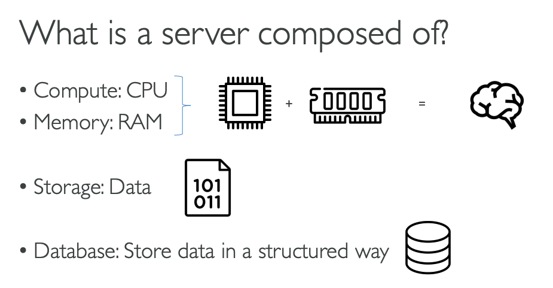

# Network fundamentals

### How does the internet work?&#x20;

Computer scientist explains the internet in 5 levels of difficulty&#x20;



How the Internet works in 5 minutes



How does the internet work? (for people that haven't  technical knowledge upfront)&#x20;



### What is a server composed of?&#x20;

<figure><figcaption></figcaption></figure>
