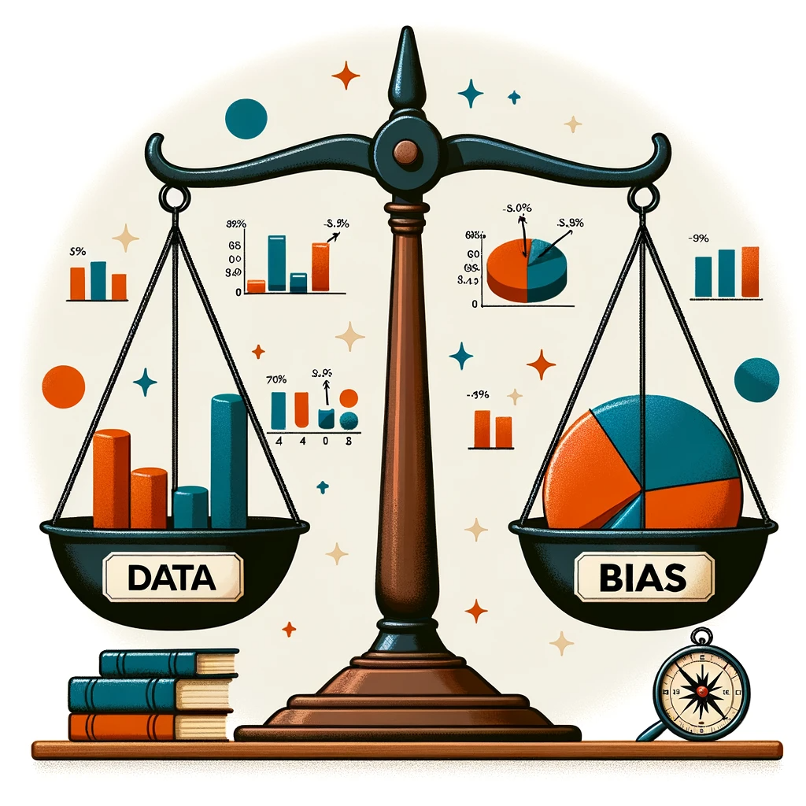

# Practical Data Science on the AWS Cloud

#### Lectures notes [https://community.deeplearning.ai/t/pds-course-1-lecture-notes/48242](https://community.deeplearning.ai/t/pds-course-1-lecture-notes/48242)

<figure><figcaption>
Machine Learning Workflow
</figcaption></figure>

#### Common ML tasks

* **Supervised learning:** Classification & Regression&#x20;
* **Unsupervised** Clustering
* **Reinforcement learning**

**The task:**

More specifically, you will perform multi-class classification for sentiment analysis of product reviews

<figure><figcaption></figcaption></figure>

### Data Bias and Feature Importance

* Describe the concept of data bias and compare popular bias metrics&#x20;
* Demonstrate how to detect data bias
* Understand feature importance

### Statistical bias

Statistical bias occurs when a data set doesn't fully and accurately represent the situation it's supposed to reflect. It's like having a skewed perspective. When data has this kind of imbalance, it can lead to misleading conclusions or predictions.

Two examples are given in the text:

1. **Credit Card Fraud Detection**: If you're trying to build a model to detect credit card fraud, and your training data primarily consists of legitimate transactions, then your model might struggle to identify fraud. That's because it hasn't "seen" or "learned from" many fraudulent transactions. It's like trying to recognize a rare bird when you've only ever seen common ones. To fix this, you might need to add more examples of fraudulent transactions to your training data.
2. **Product Review Sentiment Analysis**: If you have a product review data set that mostly has reviews for one product category (let's call it "A") and very few for others ("B" and "C"), then a sentiment prediction model trained on this data will likely be good at predicting sentiments for products in category "A". However, it might perform poorly for products in categories "B" and "C". It's like being an expert in reviewing smartphones but not so knowledgeable about reviewing laptops or cameras.

In both cases, the bias in the data leads to models that might not work as expected, especially in scenarios that they aren't well-prepared for. This can have consequences for businesses, from making poor decisions based on the model's predictions to facing regulatory issues.

### Statistical bias causes

1. **Activity Bias (Social Media Content)**: This arises from human-generated content, especially on social media. A small percentage of the population actively participates on these platforms, so the data collected is not representative of the entire population.
2. **Societal Bias (Human-generated content)**: This bias is present in data generated by humans, both on and off social media. It emerges from pre-existing societal notions. Since everyone has unconscious biases, the data they produce can reflect these biases.
3. **Feedback Loops (Selection bias)**: Bias can sometimes be introduced by the machine learning system itself. For instance, if a machine learning application provides users with options, and then uses their selections as training data, it can create feedback loops. An example given is a streaming service recommending movies based on a user's previous selections and ratings, which might not always capture the user's true preferences.
4. **Data Drift**: After a model is trained and deployed, the data it encounters in the real world can differ from the training data. This change in data distribution is known as data drift or data shift. There are different types:
   * **Covariant Drift**: When the distribution of the independent variables or features changes.
   * **Prior Probability Drift**: When the distribution of the labels or target variables changes.
   * **Concept Drift (or Concept Shift)**: When the relationship between features and labels changes. An example provided is the different terms used for soft drinks across various regions.
5. **Human Interpretation and Regional Differences**: The example of soft drinks being called "soda" in some areas and "pop" in others highlights how human interpretation and regional differences can introduce variations in labels and data.

Given these potential sources of bias, it's vital to monitor and detect biases in datasets continuously, both before and after training models. The focus is on identifying these biases and imbalances in the pre-training datasets.

### What are facets?&#x20;

A facet of a dataset refers to a specific feature or attribute within that dataset that is of particular interest, especially when analyzing for imbalances, biases, or other specific characteristics. In essence, a facet is a dimension or aspect of the data that one wants to examine more closely or treat as a sensitive attribute. Analyzing facets allows for a more granular understanding of how different attributes or features may be distributed or represented within the dataset.

For example, in a dataset of employee records, "gender" or "ethnicity" might be considered facets if you're studying diversity in the workplace. Similarly, in a product review dataset, the "product category" might be a facet if you're interested in analyzing reviews based on different product types.

### Measuring statistical bias

Statistical bias and imbalances in datasets can arise due to various reasons. To quantify these imbalances, specific metrics target different facets of your dataset. A facet refers to a sensitive or important feature in your dataset you want to assess for imbalances. For instance, in a product review dataset, the product category might be a facet of interest.

Two key metrics are:

1. **Class Imbalance (CI)**: This metric gauges the disparity in the number of examples for different facet values. In the context of a product review dataset, CI would determine if a specific product category, like Category A, has a significantly larger number of reviews compared to other categories.
2. **Difference in Proportions of Labels (DPL)**: DPL evaluates the imbalance in positive outcomes between various facet values. Using the product review example, DPL checks if a particular category, such as Category A, has notably higher ratings than others. In contrast to CI, which focuses on the quantity of reviews, DPL concentrates on the quality (ratings) of those reviews.

While these are two primary metrics, there are many others available to evaluate different types of biases in datasets. Additional information on these metrics can be found in the provided reading materials.

### Approaches to Statistical Bias Detection

There are two primary tools for detecting statistical bias in datasets: SageMaker Data Wrangler and SageMaker Clarify.

1. **SageMaker Data Wrangler**:
   * **Approach**: Provides a UI-based visual experience.
   * **Use Cases**: Suitable for users who prefer visually exploring data, connecting to multiple data sources, and configuring bias reports using dropdowns and option buttons. It allows the launching of bias detection jobs with a button click.
   * **Limitation**: Uses only a subset of your data for bias detection.
2. **SageMaker Clarify**:
   * **Approach**: Offers an API-based method.
   * **Features**: It can scale out the bias detection process using a construct known as processing jobs, which lets users configure a distributed cluster for executing bias detection at a larger scale.
   * **Use Cases**: Ideal for analyzing large data volumes, like millions of product reviews, to detect bias. It leverages the scalability and capacity of the Cloud.

### What is feature importance?&#x20;

In machine learning (ML) engineering, "feature importance" refers to a method or metric that helps determine the significance or contribution of individual features (or variables) to the predictive power of a model. Understanding feature importance is crucial for several reasons:

1. **Model Interpretability**: Knowing which features are most influential helps in understanding how the model makes its decisions, which is crucial for explaining the model's behaviour to stakeholders.
2. **Feature Selection**: If certain features have minimal or no importance, they might be excluded from the model, simplifying it and potentially improving its performance by reducing overfitting.
3. **Domain Knowledge Validation**: Feature importance can be used to validate if the model's decisions align with domain expertise. For instance, in a real estate price prediction model, one would expect features like "location" and "square footage" to be of high importance.
4. **Model Debugging**: If an irrelevant feature appears to be highly important, it might indicate issues with data quality or model training.
5. **Resource Optimization**: Collecting data for certain features can be expensive or time-consuming. If a feature is of low importance, resources can be reallocated more efficiently.

Various algorithms provide different methods to calculate feature importance. For example:

* **Tree-based models** (like Decision Trees, Random Forests, and gradient-boosted trees) have built-in methods to report feature importance based on how frequently a feature is used to split the data and its impact on model accuracy.
* **Linear models** can use the magnitude of coefficients as a measure of feature importance.
* **Permutation Importance**: It involves shuffling one feature's values and measuring the decrease in model performance. A significant decrease indicates high feature importance.
* **SHAP (Shapley Additive exPlanations)** values provide a unified measure of feature importance and fair allocation of contribution to each feature.





