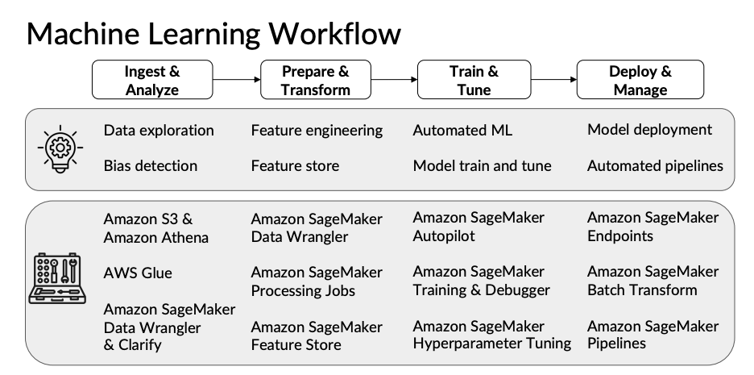
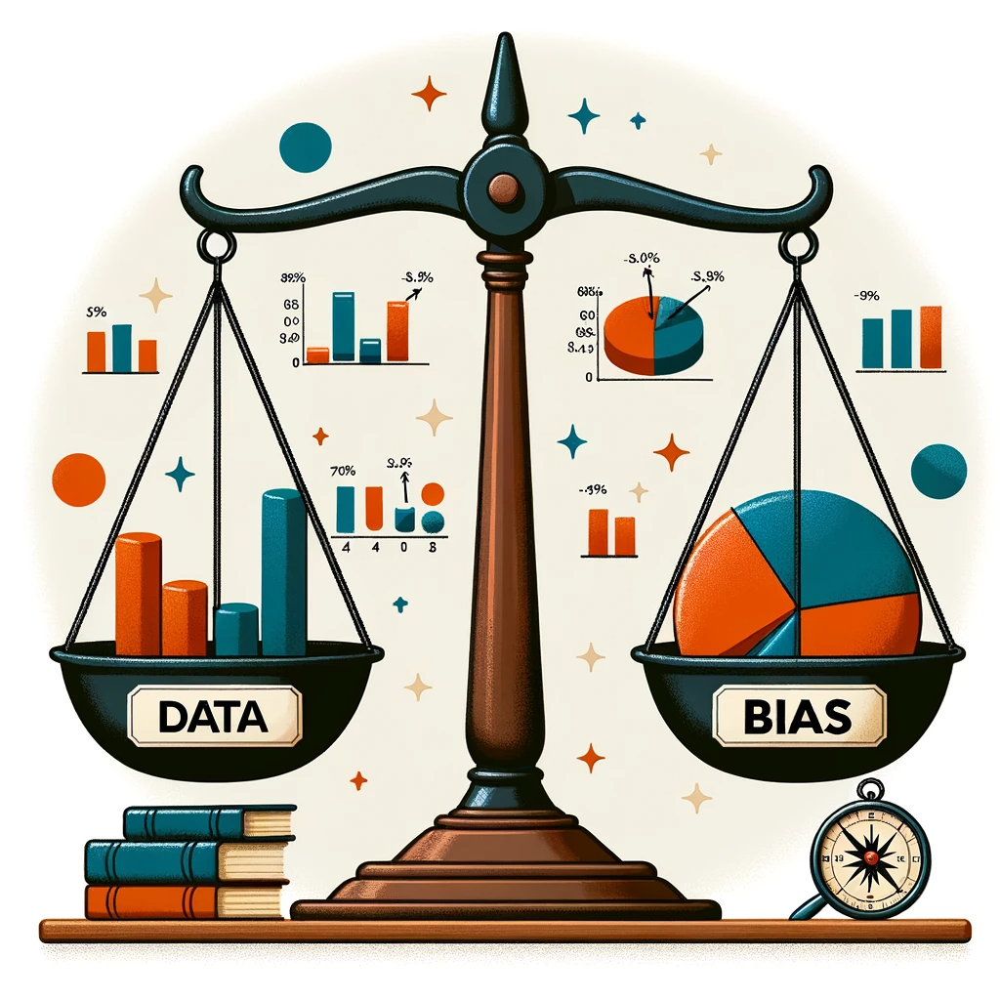
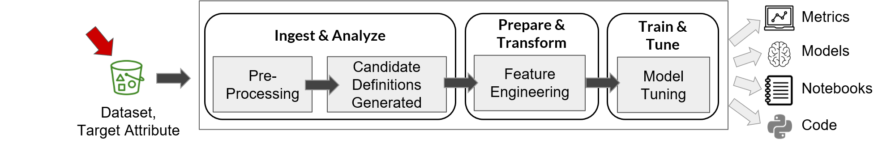

# 📋 Practical Data Science on the AWS Cloud

## 📋 Practical Data Science on the AWS Cloud

Here's a table of contents with links to all the topics in your markdown:

* [📋 Practical Data Science on the AWS Cloud](./#-practical-data-science-on-the-aws-cloud)
  * [Popular ML tasks and learning paradigms](./#popular-ml-tasks-and-learning-paradigms)
* [Data Bias and Feature Importance](./#data-bias-and-feature-importance)
  * [Statistical bias](./#statistical-bias)
    * [Statistical bias causes](./#statistical-bias-causes)
    * [What are facets?](./#what-are-facets)
    * [Measuring Statistical Bias](./#measuring-statistical-bias)
    * [Approaches to Statistical Bias Detection](./#approaches-to-statistical-bias-detection)
  * [What is feature importance?](./#what-is-feature-importance)
  * [Automated Machine Learning - AutoML](./#automated-machine-learning---automl)
  * [Built-in algorithms](./#built-in-algorithms)
  * [Why use built-in algorithms?](./#why-use-built-in-algorithms)
  * [ML types tasks and built-in algorithms](./#ml-types-tasks-and-built-in-algorithms)
    * [Classification and Regression in Machine Learning](./#classification-and-regression-in-machine-learning)
  * [Classification and Regression - Tabular data](./#classification-and-regression---tabular-data)
  * [Clustering](./#clustering)
  * [Image processing](./#image-processing)
  * [Text analysis](./#text-analysis)
  * [Evolution of text analysis algorithms](./#evolution-of-text-analysis-algorithms)
  * [Additional reading material](./#additional-reading-material)

Each section and subsection title is a hyperlink that will take you directly to the corresponding part of the document. This structure allows for easy navigation and quick access to specific topics within the markdown.

Deep learning notes from the course [https://www.coursera.org/learn/aws-practical-data-science](https://www.coursera.org/learn/aws-practical-data-science)

Lectures notes [https://community.deeplearning.ai/t/pds-course-1-lecture-notes/48242](https://community.deeplearning.ai/t/pds-course-1-lecture-notes/48242)

<figure><figcaption><p>Machine Learning Workflow</p></figcaption></figure>

#### Popular ML tasks and learning paradigms

* **Supervised learning**: Classification & Regression
* **Unsupervised** Clustering
* **Reinforcement learning**
* **Computer vision**
* **Text Analysis**
* **Natural Language Processing**

<figure><figcaption></figcaption></figure>

**The task:**

More specifically, you will perform multi-class classification for sentiment analysis of product reviews, using the Amazon SageMaker built-in BlazingText algorithm. You will train a model to predict whether a review is positive, negative, or neutral. You will also learn how to deploy the model and make predictions.

<figure><figcaption></figcaption></figure>

## Data Bias and Feature Importance

* Describe the concept of data bias and compare popular bias metrics
* Demonstrate how to detect data bias
* Understand feature importance
* Demonstrate how to detect feature importance
* Demonstrate how to use SageMaker Clarify to detect bias and feature importance
* Demonstrate how to use SageMaker Data Wrangler to detect bias and feature importance

<figure><figcaption></figcaption></figure>

### Statistical bias

Statistical bias exists in numerous stages of the data collection and analysis process, including the source of the data, the methods used to collect the data, the [estimator](https://en.wikipedia.org/wiki/Estimator) chosen, and the methods used to analyze the data

Statistical bias occurs when a data set doesn't fully and accurately represent the situation it's supposed to reflect. It's like having a skewed perspective. When data has this kind of imbalance, it can lead to misleading conclusions or predictions.

Two examples are given in the text:

1. **Credit Card Fraud Detection:** If you're trying to build a model to detect credit card fraud, and your training data primarily consists of legitimate transactions, then your model might struggle to identify fraud. That's because it hasn't "seen" or "learned from" many fraudulent transactions. It's like trying to recognize a rare bird when you've only ever seen common ones. To fix this, you might need to add more examples of fraudulent transactions to your training data.
2. **Product Review Sentiment Analysis**: If you have a product review data set that mostly has reviews for one product category (let's call it "A") and very few for others ("B" and "C"), then a sentiment prediction model trained on this data will likely be good at predicting sentiments for products in category "A". However, it might perform poorly for products in categories "B" and "C". It's like being an expert in reviewing smartphones but not so knowledgeable about reviewing laptops or cameras.
3. **Healthcare Diagnosis Model:** Imagine you're developing a machine learning model to diagnose a particular disease, and your training data is sourced from hospitals in urban areas only. This data might not be representative of the broader population, particularly those in rural areas who might have different lifestyles, access to healthcare, and disease prevalence. It's akin to learning how to diagnose based on city dwellers and then trying to apply that knowledge to someone living in the countryside. To correct this, you'd need to include data from a variety of geographical locations.
4. **Job Applicant Screening Tool:** Suppose a company is using a machine learning model to screen job applicants. If the data used to train the model is mostly composed of successful applicants from a particular university or demographic, the model might develop a bias toward those candidates. It’s like having a preference for chocolate ice cream because that’s mostly what you’ve been offered, even though other flavors might be just as good. To mitigate this, the company would need to ensure a diverse range of successful applicants in their training data.
5.  **Ice Cream Flavor Recommendation System:**

    Imagine you're developing a recommendation system for an ice cream shop. The shop has historically sold mostly chocolate and vanilla flavours, so your dataset for training the recommendation system is heavily skewed toward these two flavors. Consequently, the system might start to recommend chocolate or vanilla more often to new customers, even if they might prefer other flavors like strawberry or mint chocolate chip. It's like assuming everyone prefers the same flavors because those are the ones you sell the most. This could lead to a self-fulfilling prophecy where the shop continues to sell mostly chocolate and vanilla, not because they are universally preferred, but because they are most frequently recommended. To counter this bias, you would need to either collect more balanced data reflecting all available flavours or adjust the recommendation algorithm to account for the underrepresentation of certain flavours.

In all cases, the bias in the data leads to models that might not work as expected, especially in scenarios that they aren't well-prepared for. This can have consequences for businesses, from making poor decisions based on the model's predictions to facing regulatory issues.



#### Statistical bias causes

1. **Activity Bias (Social Media Content)**: This arises from human-generated content, especially on social media. A small percentage of the population actively participates on these platforms, so the data collected is not representative of the entire population.
2. **Societal Bias (Human-generated content)**: This bias is present in data generated by humans, both on and off social media. It emerges from pre-existing societal notions. Since everyone has unconscious biases, the data they produce can reflect these biases.
3. **Feedback Loops (Selection bias)**: Bias can sometimes be introduced by the machine learning system itself. For instance, if a machine learning application provides users with options, and then uses their selections as training data, it can create feedback loops. An example given is a streaming service recommending movies based on a user's previous selections and ratings, which might not always capture the user's true preferences.
4. **Data Drift**: After a model is trained and deployed, the data it encounters in the real world can differ from the training data. This change in data distribution is known as data drift or data shift. There are different types:
   * **Covariant Drift**: When the distribution of the independent variables or features changes.
   * **Prior Probability Drift**: When the distribution of the labels or target variables changes.
   * **Concept Drift (or Concept Shift)**: When the relationship between features and labels changes. An example provided is the different terms used for soft drinks across various regions.
5. **Human Interpretation and Regional Differences**: The example of soft drinks being called "soda" in some areas and "pop" in others highlights how human interpretation and regional differences can introduce variations in labels and data.

Given these potential sources of bias, it's vital to monitor and detect biases in datasets continuously, both before and after training models. The focus is on identifying these biases and imbalances in the pre-training datasets.

#### What are facets?

A facet of a dataset refers to a specific feature or attribute within that dataset that is of particular interest, especially when analyzing for imbalances, biases, or other specific characteristics. In essence, a facet is a dimension or aspect of the data that one wants to examine more closely or treat as a sensitive attribute. Analyzing facets allows for a more granular understanding of how different attributes or features may be distributed or represented within the dataset.

Examples of facets

1. **Gender as a Facet**: If you have a dataset of employees, you might treat gender as a facet to examine for pay equity. Analyzing salaries across this facet could reveal gender pay gaps.
2. **Age Group as a Facet**: In a dataset of users for a social media platform, age group could be a facet. You might analyze engagement or content preferences across different age groups to understand usage patterns or to detect any age-related biases in content recommendation algorithms.
3. **Geographic Location as a Facet**: For a dataset containing medical records, geographic location could be a facet. Analyzing treatment outcomes across different regions could help identify if certain areas lack access to specific medical resources, indicating a geographical bias.
4. **Education Level as a Facet**: In a dataset of job applicants, education level might be a facet of interest. By examining the hiring rates across different education levels, you could assess if there's an unintentional bias towards candidates with a certain educational background.
5. **Ethnicity as a Facet**: If you're working with a dataset of loan applications, ethnicity might be a facet you'd want to examine closely. Analyzing loan approval rates across different ethnic groups can help uncover any potential biases in the loan approval process.

#### Measuring Statistical Bias

Statistical bias and imbalances in datasets can arise due to various reasons. To quantify these imbalances, specific metrics target different facets of your dataset. A facet refers to a sensitive or important feature in your dataset you want to assess for imbalances. For instance, in a product review dataset, the product category might be a facet of interest.

Two key metrics are:

1. **Class Imbalance (CI)**: This metric gauges the disparity in the number of examples for different facet values. In the context of a product review dataset, CI would determine if a specific product category, like Category A, has a significantly larger number of reviews compared to other categories.

<figure><figcaption></figcaption></figure>

1. **Difference in Proportions of Labels (DPL)**: DPL evaluates the imbalance in positive outcomes between various facet values. Using the product review example, DPL checks if a particular category, such as Category A, has notably higher ratings than others. In contrast to CI, which focuses on the quantity of reviews, DPL concentrates on the quality (ratings) of those reviews.

[Fairness Measures for Machine Learning](https://pages.awscloud.com/rs/112-TZM-766/images/Fairness.Measures.for.Machine.Learning.in.Finance.pdf)

[Measure pre-training bias - Amazon Sagemaker](https://docs.aws.amazon.com/sagemaker/latest/dg/clarify-measure-data-bias.html)

#### Approaches to Statistical Bias Detection

There are two primary tools for detecting statistical bias in datasets: SageMaker Data Wrangler and SageMaker Clarify.

1. **SageMaker Data Wrangler**:
   * **Approach**: Provides a UI-based visual experience.
   * **Use Cases**: Suitable for users who prefer visually exploring data, connecting to multiple data sources, and configuring bias reports using dropdowns and option buttons. It allows the launching of bias detection jobs with a button click.
   * **Limitation**: Uses only a subset of your data for bias detection.
2. **SageMaker Clarify**:
   * **Approach**: Offers an API-based method.
   * **Features**: It can scale out the bias detection process using a construct known as processing jobs, which lets users configure a distributed cluster for executing bias detection at a larger scale.
   * **Use Cases**: Ideal for analyzing large data volumes, like millions of product reviews, to detect bias. It leverages the scalability and capacity of the Cloud.

### What is feature importance?

In machine learning (ML) engineering, "feature importance" refers to a method or metric that helps determine the significance or contribution of individual features (or variables) to the predictive power of a model. Understanding feature importance is crucial for several reasons:

1. **Model Interpretability**: Knowing which features are most influential helps in understanding how the model makes its decisions, which is crucial for explaining the model's behaviour to stakeholders.
2. **Feature Selection**: If certain features have minimal or no importance, they might be excluded from the model, simplifying it and potentially improving its performance by reducing overfitting.
3. **Domain Knowledge Validation**: Feature importance can be used to validate if the model's decisions align with domain expertise. For instance, in a real estate price prediction model, one would expect features like "location" and "square footage" to be of high importance.
4. **Model Debugging**: If an irrelevant feature appears to be highly important, it might indicate issues with data quality or model training.
5. **Resource Optimization**: Collecting data for certain features can be expensive or time-consuming. If a feature is of low importance, resources can be reallocated more efficiently.

Various algorithms provide different methods to calculate feature importance. For example:

* **Tree-based models** (like Decision Trees, Random Forests, and gradient-boosted trees) have built-in methods to report feature importance based on how frequently a feature is used to split the data and its impact on model accuracy.
* **Linear models** can use the magnitude of coefficients as a measure of feature importance.
* **Permutation Importance**: It involves shuffling one feature's values and measuring the decrease in model performance. A significant decrease indicates high feature importance.
* **SHAP (Shapley Additive exPlanations)** values provide a unified measure of feature importance and fair allocation of contribution to each feature.





### Automated Machine Learning - AutoML

* Ability to reduce Time to market
* Lack of ML skillsets
* Ability to iterate quickly
* Ability to optimize scarce resources for more challenging use cases

SageMaker Autopilot will inspect the raw dataset, apply feature processors, pick the best set of algorithms, train and tune multiple models, and then rank the models based on performance - all with just a few clicks. Autopilot transparently generates a set of Python scripts and notebooks for a complete end-to-end pipeline including data analysis, candidate generation, feature engineering, and model training/tuning.

SageMaker Autopilot job consists of the following high-level steps:

* _Data analysis_ where the data is summarized and analyzed to determine which feature engineering techniques, hyper-parameters, and models to explore.
* _Feature engineering_ where the data is scrubbed, balanced, combined, and split into train and validation.
* _Model training and tuning_ where the top performing features, hyper-parameters, and models are selected and trained.

<figure><figcaption><p>AutoML</p></figcaption></figure>

1. Extract

```
aws s3 cp 's3://dlai-practical-data-science/data/balanced/womens_clothing_ecommerce_reviews_balanced.csv' ./
```

```python
path_autopilot = './womens_clothing_ecommerce_reviews_balanced_for_autopilot.csv'

df[['sentiment', 'review_body']].to_csv(path_autopilot, 
                                        sep=',', 
                                        index=False)
autopilot_train_s3_uri = sess.upload_data(bucket=bucket, key_prefix='autopilot/data', path=path_autopilot)
autopilot_train_s3_uri
```

```python
aimport time

timestamp = int(time.time())
auto_ml_job_name = 'automl-dm-{}'.format(timestamp)
model_output_s3_uri = 's3://{}/autopilot'.format(bucket)

max_candidates = 3

automl = sagemaker.automl.automl.AutoML(
    ### BEGIN SOLUTION - DO NOT delete this comment for grading purposes
    target_attribute_name="sentiment", # Replace None
    base_job_name=auto_ml_job_name, # Replace None
    output_path=model_output_s3_uri, # Replace None
    ### END SOLUTION - DO NOT delete this comment for grading purposes
    max_candidates=max_candidates,
    sagemaker_session=sess,
    role=role,
    max_runtime_per_training_job_in_seconds=1200,
    total_job_runtime_in_seconds=7200
)

automl.fit(
    ### BEGIN SOLUTION - DO NOT delete this comment for grading purposes
    autopilot_train_s3_uri, # Replace None
    ### END SOLUTION - DO NOT delete this comment for grading purposes
    job_name=auto_ml_job_name, 
    wait=False, 
    logs=False
)
```

Autopilot job status

[Autogluon](<../README (1).md>)


paper


## Built-in algorithms

* Summarize why and when to choose built-in algorithms
* Describe the use case and algorithms
* Understand the evolution of text analysis algorithms
* Discuss word2vec, FastText and BlazingText algorithms
* Transform raw review data into features to train a text classifier
* Apply the Amazon SageMaker built-in BlazingText algorithm to train a text classifier
* Deploy the text classifier and make predictions

<figure><figcaption></figcaption></figure>

#### Why use built-in algorithms?

* Implementation is highly highly-optimized and scalable (shift between CPU tp GPU as simple as a parameter of type of machine)
* Focus more on domain-specific tasks rather than managing low-level model code and infrastructure
* Trained model can be downloaded and re-used elsewhere

<figure><figcaption></figcaption></figure>

#### ML types tasks and built-in algorithms

<figure><figcaption></figcaption></figure>

**Classification and Regression in Machine Learning**

**Classification Algorithms**

1. **What is Classification?**
   * **Purpose**: Classification algorithms are used when the output is a category, like "spam" or "not spam", "disease" or "no disease".
   * **Type of Output**: Discrete, categorical.
   * **Examples**: Decision Trees, Naive Bayes, Support Vector Machines (SVM), Logistic Regression, Neural Networks.
2. **How It Works**:
   * **Input**: Data with known categories.
   * **Process**: The algorithm learns by mapping input data (features) to the known categories (labels).
   * **Prediction**: Classifies new, unseen data into these categories.
3. **Use Cases**:
   * Email spam filters (spam or not).
   * Medical diagnosis (diseased or healthy).
   * Image recognition (identifying objects in images).

**Regression Algorithms**

1. **What is Regression?**
   * **Purpose**: Regression algorithms predict a continuous quantity. For example, predicting temperatures, prices, or ages.
   * **Type of Output**: Continuous, numeric.
   * **Examples**: Linear Regression, Polynomial Regression, Lasso Regression, Ridge Regression.
2. **How It Works**:
   * **Input**: Data with known continuous output values.
   * **Process**: The algorithm models the relationship between input features and a continuous output variable.
   * **Prediction**: Predicts a continuous value for new, unseen data.
3. **Use Cases**:
   * Predicting real estate prices.
   * Forecasting weather conditions.
   * Estimating life expectancies.

**Key Differences**

* **Output Type**: Classification predicts discrete categories, while regression predicts continuous values.
* **Evaluation Metrics**: Classification uses accuracy, precision, recall, etc., whereas regression uses Mean Squared Error (MSE), R-squared, etc.
* **Nature of Prediction**: Classification provides a label (like 'cat' or 'dog'), while regression provides a quantifiable prediction (like '24.5 degrees Celsius').

#### Classification and Regression - Tabular data

<table><thead><tr><th width="318">Example problems and use cases</th><th width="237.33333333333331">Problem types</th><th>Built-in algorithms</th></tr></thead><tbody><tr><td>Predict if an item belongs to a category: an email spam filter</td><td>Binary/multi-class classification</td><td>XGBoost, K-Nearest Neighbors</td></tr><tr><td>Predict a numeric/continuous value: estimate the value of a house</td><td>Regression</td><td>Linear Learner, XGboost</td></tr><tr><td>Predict sales on a new product based on previous sales data</td><td>Time-series forecasting</td><td>DeepAR Forecasting</td></tr></tbody></table>

#### Clustering

| Example problem and use cases                                             | Problema type                          | Built-in algorithms                                         |
| ------------------------------------------------------------------------- | -------------------------------------- | ----------------------------------------------------------- |
| Drop weak features such as the color of a car when predicting its mileage | Feature enginnering: reduce dimensions | Principal component analysis (PCA)                          |
| Detect abnormal behavior                                                  | Anomaly detection                      | Random cut forest (RCF)                                     |
| Group high/medium/low-spending customer from transaction histories        | Clustering / Grouping                  | K-Means                                                     |
| Organize a set of documents into topics based on words and phares         | Topic modeling (NLP)                   | Latent Dirichlet Allocation (LDA), Neural Topic Model (NTM) |
|                                                                           |                                        |                                                             |
|                                                                           |                                        |                                                             |

#### Image processing

| Example problems and uses cases                 | Problem types        | Buil-in algoritms                                       |
| ----------------------------------------------- | -------------------- | ------------------------------------------------------- |
| Content moderation                              | Image classification | Image classification (full training, transfer learning) |
| Detect people and objects in an image           | Object detection     | Object detection                                        |
| Self-driven cars identify objects in their path | Computer vision      | Semantic Segmentation                                   |

#### Text analysis

| Example problems and use cases       | Problem types       | Built-in algoritms   |
| ------------------------------------ | ------------------- | -------------------- |
| Convert spanish to english           | machine translation | sequence-to-sequence |
| Summarize a research paper           | Text sumarization   | sequence-to-sequence |
| Transcribe call center conversations | Speech-to-text      | Sequence-to-sequence |
| Classify reviews into categories     | Text classification | Blazing Text         |

#### Evolution of text analysis algorithms

<figure><figcaption></figcaption></figure>

#### Additional reading material

* [Word2Vec algorithm](https://arxiv.org/pdf/1301.3781.pdf)
* [GloVe algorithm](https://www.aclweb.org/anthology/D14-1162.pdf)
* [FastText algorithm](https://arxiv.org/pdf/1607.04606v2.pdf)
* [Transformer architecture, "Attention Is All You Need"](https://arxiv.org/abs/1706.03762)
* [BlazingText algorithm](https://dl.acm.org/doi/pdf/10.1145/3146347.3146354)
* [ELMo algorithm](https://arxiv.org/pdf/1802.05365v2.pdf)
* [GPT model architecture](https://cdn.openai.com/research-covers/language-unsupervised/language\_understanding\_paper.pdf)
* [BERT model architecture](https://arxiv.org/abs/1810.04805)
* [Built-in algorithms](https://docs.aws.amazon.com/sagemaker/latest/dg/algos.html)
* [Amazon SageMaker BlazingText](https://docs.aws.amazon.com/sagemaker/latest/dg/blazingtext.html)

### Build, Train, and Deploy ML Pipelines using BERT

<figure><figcaption></figcaption></figure>

#### Feature Engineering

<figure><figcaption></figcaption></figure>

**Learning objective**

* Describe the concept of feature engineering
* Apply feature engineering to prepare datasets for training

Feature engineering in machine learning is like **picking the right ingredients for a recipe**. Imagine you're making a dish and you want it to taste amazing. You carefully choose which ingredients to use, how to prepare them, and in what quantities. In machine learning, the "dish" is the model you're building, and the "ingredients" are the features (data) you put into it.

<figure><figcaption></figcaption></figure>

**Feature engineering steps**

1. **Selecting the Right Features**: This is like choosing ingredients that will make your dish flavorful. In machine learning, you pick the most relevant and useful data (features) that can help your model learn and make accurate predictions.
   1. Reduce feature dimensionality
   2. Train models faster
   3. Feature importance report
2. **Removing Unnecessary Features**: Just like you wouldn't add every spice in your rack to a dish, in machine learning, you remove data that doesn't help or might confuse your model.
3. **Transforming Features**: Sometimes, the raw ingredients you have aren't ready to be used directly in cooking. You might need to chop, grind, or season them. Similarly, in feature engineering, you often need to change or process your data so that it's in the best form for your model. This can include scaling (changing the range), normalizing (making the data fit a standard format), or encoding categorical data into a numerical format.
   1. Transform no numerical features to numerical features
4. **Creating New Features**: Imagine you're cooking and you decide to mix two ingredients to create a new flavour. In machine learning, you can combine or manipulate existing data features to create new ones that might give your model more insight.
   1. Lead to more accurate predictions

**Feature engineering Pipeline**

<figure><figcaption></figcaption></figure>

**Split dataset**

<figure><figcaption></figcaption></figure>

### Feature store

<figure><figcaption></figcaption></figure>

* Centralized
* Reusable
* Discoverable

#### AWS Sagemaker feature store

* Store and server features
* Reduce skew
* Real-time & batch

**BERT vs BlazingText**

**BERT** uses a bidirectional transformer architecture and therefore generates contextual embeddings. If the same word is used in different ways, BERT will capture different meanings and therefore produce 2 different vectors to represent the different meanings.

**BlazingText**, in contrast to BERT, does not inherently produce different embeddings for the same word based on its context. BlazingText is based on the Word2Vec architecture, specifically on its Skip-Gram and Continuous Bag-of-Words (CBOW) models, which generate static word embeddings.

\\

| Feature                   | BERT                                                                                                          | BlazingText                                                                                           |
| ------------------------- | ------------------------------------------------------------------------------------------------------------- | ----------------------------------------------------------------------------------------------------- |
| **Architecture**          | Based on the Transformer model.                                                                               | Based on the Word2Vec model, specifically Skip-Gram and CBOW architectures.                           |
| **Contextual Embeddings** | Generates context-sensitive, dynamic embeddings.                                                              | Produces static word embeddings; the same word has the same representation regardless of context.     |
| **Representation**        | Contextual word and sentence embeddings.                                                                      | Primarily word-level embeddings.                                                                      |
| **Embedding Nature**      | Different embeddings for the same word in different contexts.                                                 | Fixed embedding for each word, independent of context.                                                |
| **Complexity**            | More complex, with a larger number of parameters.                                                             | Simpler and more efficient, especially in terms of computational resources.                           |
| **Use Cases**             | Suitable for tasks requiring deep contextual understanding, like sentence classification, question answering. | Efficient for tasks where high-speed word embeddings are needed, such as large-scale text processing. |
| **Scalability**           | Resource-intensive, suitable for more complex NLP tasks.                                                      | Designed for high performance and scalability, particularly on AWS.                                   |
| **Flexibility**           | Highly flexible for a wide range of NLP tasks.                                                                | Efficient for generating word embeddings but less flexible for context-dependent tasks.               |

[**https://huggingface.co/blog/bert-101#1-what-is-bert-used-for**](https://huggingface.co/blog/bert-101#1-what-is-bert-used-for)

**references:**

* [A few useful things to know about Machine Learning](https://homes.cs.washington.edu/\~pedrod/papers/cacm12.pdf)
* [How to avoid machine learning pitfalls a guide for academic researchers](https://arxiv.org/pdf/2108.02497.pdf)
* [Tidy Data](https://www.jstatsoft.org/article/view/v059i10)
* [Fundamental Techniques of Feature Engineering for Machine Learning](https://towardsdatascience.com/feature-engineering-for-machine-learning-3a5e293a5114)

#### Train, Debug and Profile a Machine Learning Model

#### Build-in algorithms versus pre-trained models

<figure><figcaption></figcaption></figure>

#### Build-in algorithms versus pre-trained models

**Built-in Algorithms**

1. **Definition**: Built-in algorithms are ready-to-use algorithms provided by machine learning platforms like Amazon SageMaker. These algorithms are designed to be applied directly to your data without the need for designing and coding the algorithm from scratch.
2. **Customization**: They offer limited customization compared to designing your own model. You can tweak certain parameters, but the core algorithmic structure remains the same.
3. **Use Cases**: Ideal for standard machine learning tasks where common algorithms are proven to be effective, such as regression, classification, clustering, etc.
4. **Advantages**:
   * **Ease of Use**: They are easy to deploy and use, especially for those not looking to delve deeply into algorithmic complexities.
   * **Optimized Performance**: Often optimized for performance and scalability within the platform they are provided on.
5. **Limitations**:
   * **Less Flexibility**: Less flexibility in algorithm modification.
   * **Generalization**: May not be well-suited for highly specific or novel tasks that require unique model architectures.

**Pre-trained Models**

1. **Definition**: Pre-trained models are models that have already been trained on a large dataset, usually on a general task like image recognition, language processing, etc. They are used as a starting point for further training on a specific task (a process known as transfer learning).
2. **Customization**: They offer more flexibility. You can fine-tune these models on your specific dataset, adapting them to your particular needs.
3. **Use Cases**: Ideal for tasks where collecting a large and diverse training dataset is difficult or for complex tasks like natural language processing, object detection, etc.
4. **Advantages**:
   * **Time and Resource Efficient**: Saves time and resources as the initial, extensive training has already been done.
   * **High Performance**: Often provide high-quality results, especially in complex domains like computer vision and NLP.
5. **Limitations**:
   * **Requirement of Domain Knowledge**: Requires understanding of how to fine-tune and adapt them to your specific task.
   * **Computational Resources**: Depending on the model size and complexity, fine-tuning can still require significant computational resources.

**Conclusion**

* **Built-in Algorithms**: Best for straightforward applications, ease of use, and when you need a quick deployment.
* **Pre-trained Models**: Best for complex tasks, achieving high accuracy, and when dealing with tasks where data collection is challenging.

#### Model pre-trained and fine tunning

<figure><figcaption></figcaption></figure>

####

#### Training of a custom model

* **Training NLP Models**: Training models like BERT from scratch is time-consuming and resource-intensive, often requiring days and powerful CPUs or GPUs.
* **Pretrained Models**: There's a wealth of pre-trained models available for adaptation to specific datasets and use cases.
* **Difference Between Built-in Algorithms and Pretrained Models**:
  * Built-in algorithms (like Blazing Text) come with complete training code; you just supply data.
  * Pretrained models have been already trained on large text datasets and require custom training code for specific tasks.
* **Concept of Pretraining and Fine-Tuning**:
  * Pretraining involves learning vocabulary and vector representations from a large corpus in an unsupervised manner.
  * Fine-tuning adapts these models to specific data sets and tasks, akin to transfer learning in NLP.
* **Examples of pretrained Models**:
  * Language-specific models like GermanBERT, CamemBERT, BERTje.
  * Domain-specific models like PatentBERT, SciBERT, ClinicalBERT.
* **Fine Tuning**: Faster than pretraining, involves fitting the model to a specific task with labeled data.
* **Sources for Pretrained Models**:
  * Model hubs in frameworks like PyTorch, TensorFlow, and Apache mxnet.
  * Hugging Face’s model hub with over 8,000 NLP models.
  * AWS SageMaker JumpStart for deploying models directly.
* **SageMaker JumpStart**: Offers easy access to pre-trained models, one-click deployment, and solutions for common ML use cases.
* **Project Focus**: Utilizing a pre trained RoBERTa model from Hugging Face for text classification, specifically for sentiment analysis of product reviews.

<figure><figcaption></figcaption></figure>

1. **BERT Pre-Training**:
   * **Masked Language Model (MLM)**: BERT masks 15% of the words in a sentence, then predicts these masked words, updating its model weights based on the accuracy of its predictions.
   * **Next Sentence Prediction (NSP)**: BERT learns to predict whether two sentences logically follow each other. It does this by replacing one sentence in a pair with a random sentence 50% of the time and then predicting if they form a coherent pair.
2. **Unsupervised Learning Approach**: Both MLM and NSP are performed as unsupervised learning using large collections of unlabeled text, such as Wikipedia and the Google Books corpus.
3. **Transferability of BERT**: The pre-trained BERT model, with its learned vocabulary and representations, can be effectively used for various NLP and NLU tasks without needing training from scratch.
4. **Fine-Tuning BERT**:
   * Implemented as supervised learning, fine-tuning adapts BERT to specific tasks like text classification or question answering.
   * This process is quicker and doesn't involve MLM or NSP, needing relatively few data samples.
5. **Application to RoBERTa**:
   * The RoBERTa model, an enhancement of BERT, omits the NSP and focuses more on MLM.
   * It's trained with larger mini-batches, learning rates, and a significantly larger dataset (160 GB vs. BERT's 16 GB).
   * These changes aim to improve RoBERTa's performance in NLP tasks, like text classification.
6. **Week's Project**: You'll be using a pre-trained RoBERTa model from Hugging Face and fine-tuning it for sentiment analysis of product reviews, classifying them into three sentiment categories.

**Debug and Profile models**

A machine learning (ML) training job can have problems such as overfitting, saturated activation functions, and vanishing gradients, which can compromise model performance.

1. **Overfitting**: This occurs when your model learns the training data too well, including its noise and outliers. As a result, it performs exceptionally on the training data but poorly on unseen data (test data). Essentially, the model becomes too complex, capturing spurious correlations that aren't actually relevant to the underlying pattern. This lack of generalization makes the model less effective in real-world applications.
2. **Saturated Activation Functions**: Activation functions in neural networks help decide whether a neuron should be activated or not, based on the input it receives. Saturated activation functions are those where the function's output doesn't change significantly for a large range of input values. The classic example is the sigmoid function, where inputs with large absolute values are mapped to 1 or 0, with very little gradient. This can lead to two issues:
   * **Slow Learning**: Because the gradient is very small, it results in slow updates to the weights during backpropagation.
   * **Dead Neurons**: In the case of functions like ReLU (Rectified Linear Unit), if the input to a neuron is always negative, the neuron never activates (always outputs zero), essentially becoming useless.
3. **Vanishing Gradients**: This problem occurs during training deep neural networks, where gradients of the loss function become smaller and smaller as they are propagated back through the layers during backpropagation. As a result, neurons in the earlier layers learn very slowly, if at all, because the gradient updates to their weights are tiny. This issue is particularly pronounced with certain activation functions like sigmoid or tanh, where gradients can be small, and their repeated multiplication (as in deep networks) leads to exponentially smaller gradients. Without meaningful updates to the weights, the network fails to learn effectively.

Each of these issues can significantly hinder a model's ability to learn effectively and generalize to new data, making it crucial to apply appropriate strategies and techniques to mitigate them during the training process.

Detect common training errors

* Vanishing gradients
* Exploding gradients
* Bad initialization
* Overfitting

Questions like:

* Are my gradient values becoming too large or too small?
* How much GPU, CPU, network and memory does my model training consume?

Take actions:

* Stop the model training if the model starts overfitting!
* Send notifications

Metrics:

* System metrics
  * CPU and GPU ( and memory) utilization
  * Network metrics
  * Data input and output (I/O) metrics
* Framework metrics
  * Convolutional operations in forward pass
  * Batch normalization operations in the backward pass
  * Data loader processes between steps
  * Gradient descent algorithm operations
* Output tensor
  * scalar values (accuracy and loss)
  * Matrices (weights, gradients, input layers, and output layers)

**Monitor and profile system resource utilization**

<figure><figcaption></figcaption></figure>

References:

* [PyTorch Hub](https://pytorch.org/hub/)
* [TensorFlow Hub](https://www.tensorflow.org/hub)
* [Hugging Face open-source NLP transformers library](https://github.com/huggingface/transformers)
* [RoBERTa model](https://arxiv.org/abs/1907.11692)
* [Amazon SageMaker Model Training (Developer Guide)](https://docs.aws.amazon.com/sagemaker/latest/dg/how-it-works-training.html)
* [Amazon SageMaker Debugger: A system for real-time insights into machine learning model training](https://www.amazon.science/publications/amazon-sagemaker-debugger-a-system-for-real-time-insights-into-machine-learning-model-training)
* [The science behind SageMaker’s cost-saving Debugger](https://www.amazon.science/blog/the-science-behind-sagemakers-cost-saving-debugger)
* [Amazon SageMaker Debugger (Developer Guide)](https://docs.aws.amazon.com/sagemaker/latest/dg/train-debugger.html)
* [Amazon SageMaker Debugger (GitHub)](https://github.com/awslabs/sagemaker-debugger)

### Deploy End-to-end machine learning pipelines

* Describe the concept of machine learning operations (MLOps) and pipelines
* Compare pipeline orchestration and automation
* Demonstrate how to orchestrate pipelines
* Discuss how to automate pipelines
* Describe the concept of model lineage and artifact tracking
* Demonstrate how to track model lineage and artifacts

**Sagemake Terminology**

This notebook focuses on the following features of Amazon SageMaker Pipelines:

* **Pipelines** - a directed acyclic graph (DAG) of steps and conditions to orchestrate SageMaker jobs and resource creation
* **Processing job steps** - a simplified, managed experience on SageMaker to run data processing workloads, such as feature engineering, data validation, model evaluation, and model explainability
* **Training job steps** - an iterative process that teaches a model to make predictions on new data by presenting examples from a training dataset
* **Conditional step execution** - provides conditional execution of branches in a pipeline
* **Registering models** - register a model in a model registry to create a deployable models in Amazon SageMaker
* **Parameterized pipeline executions** - allows pipeline executions to vary by supplied parameters
* **Model endpoint** - hosts the model as a REST endpoint to serve predictions from new data

[Data centric](https://www.youtube.com/watch?v=06-AZXmwHjo\&t=48s)



#### Optimize ML Models and Deploy Human-in-the-Loop Pipelines

**Learning Objectives**

***

* Describe practical challenges related to data for machine learning - scale, resources (storage, compute, memory)
* Explain approaches to address challenges with data for machine learning
* Describe practical challenges related to ML training such as large data sets, optimizing training time & costs
* Explain approaches to address ML training challenges using techniques such as streaming data, profiling training infrastructure monitoring, data parallelism etc.
* Describe the concept of hyper-parameter tuning
* Explain popular algorithms used for automatic model tuning
* Apply hyper-parameter tuning to a BERT-based text classifier and dataset
* Describe the concept of model evaluation
* Demonstrate how to evaluate a model

#### Advanced Model training

**Model tuning**

<figure><figcaption></figcaption></figure>

**Manual Model Tuning**

1. **What It Is**: Manual model tuning involves manually adjusting the hyperparameters of a machine learning model. Hyperparameters are the configuration settings used to structure the learning process. They are not learned from the data but are set prior to the training process.
2. **Process**:
   * **Trial and Error**: You adjust hyperparameters based on experience, intuition, or experimentation.
   * **Expertise Required**: Requires substantial knowledge of how different hyperparameters affect learning and model performance.
   * **Examples**: Adjusting learning rate, the number of layers in a neural network, batch size, etc.
3. **Advantages**:
   * **Control**: You have full control over the model configuration.
   * **Insight**: It can provide deeper understanding and insights into how the model works.
4. **Disadvantages**:
   * **Time-Consuming**: It can be very time-consuming, especially for complex models.
   * **Expertise-Dependent**: Requires significant expertise in machine learning and the specific model being used.
   * **Risk of Overfitting**: Manual tuning might lead to overfitting if not done carefully.

**Automatic Model Tuning (Hyperparameter Optimization)**

1. **What It Is**: Automatic model tuning, also known as hyperparameter optimization, uses algorithms to automatically search for the optimal set of hyperparameters for a given model.
2. **Techniques**:
   * **Grid Search**: Systematically searches through a specified subset of hyperparameters.
   * **Random Search**: Randomly selects hyperparameters from a defined range.
   * **Bayesian Optimization**: Uses a probabilistic model to guide the search for the best hyperparameters.
   * **Hyberband**
3. **Advantages**:
   * **Efficiency**: Can be more efficient, especially for large hyperparameter spaces.
   * **Less Expertise Required**: Reduces the level of expertise required to tune the model effectively.
   * **Systematic**: Often more systematic and comprehensive than manual methods.
4. **Disadvantages**:
   * **Computational Cost**: Some methods (like grid search) can be computationally expensive.
   * **Lack of Intuition**: May not provide as much insight into how each hyperparameter affects the model's performance.
   * **Overfitting Risk**: There's still a risk of overfitting, especially if the search space is not well-defined.

**Choosing Between Manual and Automatic Tuning**

* **Complexity of the Model**: For more complex models, automatic tuning might be more feasible.
* **Available Resources**: Consider computational resources and time.
* **Expertise**: If you have significant expertise, manual tuning might yield better-tuned models.
* **Project Stage**: Early experimentation might benefit from manual tuning for insights, while later stages might leverage automatic tuning for efficiency.

#### Types of automatic model tunning

**Grid Search**

* **Definition**: A method that systematically works through multiple combinations of parameter tunes, cross-validating as it goes to determine which tune gives the best performance.
* **Process**:
  * Define a grid of hyperparameter values.
  * Train a model for every combination of hyperparameters in the grid.
  * Evaluate each model using cross-validation.
  * Select the model with the best performance.
* **Advantages**:
  * Simplicity: Easy to understand and implement.
  * Exhaustive: Tests every possible combination, ensuring the best set is found within the grid.
* **Disadvantages**:
  * Computationally Expensive: Can be very slow, especially with large grids.
  * Limited by Grid Resolution: May miss the optimal set if it's not included in the predefined grid.

**Random Search**

* **Definition**: Randomly samples the search space and evaluates sets from a specified probability distribution.
* **Process**:
  * Define a search space as a bounded domain of hyperparameter values.
  * Select random combinations of hyperparameters.
  * Train and evaluate a model for each combination.
  * Repeat the process for a specified number of iterations or time limit.
* **Advantages**:
  * Faster than Grid Search: Can find a good set of hyperparameters much quicker.
  * Scalability: More efficient for high-dimensional spaces.
* **Disadvantages**:
  * Randomness: Might miss optimal parameters.
  * No Guarantee of Best Solution: Less systematic than Grid Search.

**Bayesian Optimization**

* **Definition**: Uses a probabilistic model to guide the search for the best hyperparameters, balancing exploration and exploitation.
* **Process**:
  * Build a probabilistic model of the objective function.
  * Use the model to select promising hyperparameters to evaluate in the true objective function.
  * Update the model based on the results and repeat.
* **Advantages**:
  * Efficiency: Tends to find better parameters with fewer iterations.
  * Balance: Good at balancing exploring new parameters and exploiting known good ones.
* **Disadvantages**:
  * Complexity: More complex to understand and implement than Grid or Random Search.
  * Computation Overhead: Building and updating the probabilistic model can be computationally intensive.

**Hyperband**

* **Definition**: An extension of Random Search which uses a novel bandit-based approach to hyperparameter optimization.
* **Process**:
  * Allocate a budget (like iterations, epochs) and randomly sample configurations.
  * Initially, allocate small resources to each configuration.
  * Iteratively prune the worst-performing configurations, increasing resources for the promising ones.
* **Advantages**:
  * Resource-Efficient: Quickly identifies promising hyperparameters without fully training every model.
  * Dynamic Allocation: Adjusts the allocation of resources in a data-driven way.
* **Disadvantages**:
  * Partial Training: Some models might be discarded too early, potentially missing good configurations.
  * Complexity: More complex and nuanced than basic methods like Grid or Random Search.

#### Tune BERT Text classifier

<figure><figcaption></figcaption></figure>

<figure><figcaption></figcaption></figure>

**Warm types:**

* IDENTICAL\_DATA\_AND\_ALGORITHM
  * Same input data and training data
  * Update hyperparameter tunning
* TRANSFER\_LEARNING
  * Update training data and different versions of training algorithm

#### Best Practices - Sagemaker HyperParameter Tuning

* Select a small number of hyperparameters
* Select a small range for hyperparameters
* Enable warm start
* Enable early stop to save tuning time and costs
* Select a small number of concurrent training jobs

#### Best practices - Monitoring Training Resources

* Right size computer resources
* Requires empirical testing
* Amazon CloudWatch Metrics
* Insights from Amazon SageMaker Debugger

#### Machine Learning - Checkpointing

* Save state of ML models during training
* Checkpoints: Snapshot of the model
  * Model architecture
  * Model weights
  * Training configurations
  * Optimizer
* Frequency and number of checkpoints

#### Distributed Training Strategies

* Increased training data volume
* Increased model size and complexity

<figure><figcaption></figcaption></figure>

**Data Parallelism**

* Training data split up
* The model replicated on all nodes

**Model Parallelism**

* Training data replicated
* Model split up on all nodes

<figure><figcaption></figcaption></figure>

**Advanced model deployment and monitoring**

Deploy models with A/B testing, monitor model performance, and detect drift from baseline metrics.

**Learning objectives:**

* Describe practical challenges related to ML deployment & monitoring
* Explain approaches to address deployment and monitoring challenges using techniques such as autoscaling, automating model quality monitoring, automating retraining pipelines
* Evaluate model deployment options and considerations
* Describe common deployment challenges and strategies for models
* Explain the considerations for monitoring a machine learning workload
* Describe approaches to model monitoring
* Discuss how to use Amazon SageMaker to perform A/B testing
* Demonstrate deploying a model version to Amazon SageMaker using A/B testing

**Data Labeling:**

<figure><figcaption></figcaption></figure>

<figure><figcaption></figcaption></figure>

**What is data labelling?**

* Process of identifying raw data and adding one or more meaningful and informative labels
* Labels provide context for machine learning models to learn from supervised learning
* Correctly labelled datasets are often called "ground truth"

**Common types of data labelling**

<figure><figcaption></figcaption></figure>

<figure><figcaption></figcaption></figure>

<figure><figcaption></figcaption></figure>

**Challenges**

* Time-consumingMassive scale
* High accuracy
* Time-consuming

**How can data labelling be done efficiently?**

* Access to the additional human workforce
* Automated data labelling capabilities
* Assistive labeling features

**AWS Sagemaker ground truth**

<figure><figcaption></figcaption></figure>

**Steps**

Setup input data >> Selecting labeling task >> Select human workforce >> Create task UI

**Best practices for data labelling:**

* Provide clear instructions
* Consolidate annotations to improve label quality
* Verify and adjust labels
* Use automated data labelling on large datasets (Active Learning)
* Re-use prior labelling jobs to create hierarchical labels

**Human in the Loop Pipelines**

<figure><figcaption></figcaption></figure>

**Challenges:**

* Need ML scientists, engineering and operations teams
* Need to manage a large number of reviewers
* Need to write custom software to manage review tasks
* Difficult to achieve high review accuracy

**Amazon A2I**

<figure><figcaption></figcaption></figure>

**Steps**

<figure><figcaption></figcaption></figure>
